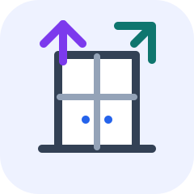

<p align="center">
  
</p>

<h1 align="center">CAD Agent Sandbox</h1>

<p align="center">
  A Windows-first benchmark workspace for comparing local, free CAD-as-code toolchains against the same furniture specifications.
</p>

<p align="center">
  <a href="README.ja.md">日本語</a> | <a href="https://sunwood-ai-labs.github.io/cad-agent-sandbox/">Docs site</a> | <a href="docs/index.md">Docs source</a>
</p>

<p align="center">
  <a href="https://github.com/Sunwood-ai-labs/cad-agent-sandbox/actions/workflows/ci.yml"></a>
  <a href="https://github.com/Sunwood-ai-labs/cad-agent-sandbox/actions/workflows/pages.yml"></a>
  <a href="LICENSE"></a>
  
  
</p>

## 🚪 What This Is

CAD Agent Sandbox keeps repeatable CAD-as-code benchmark cases under `cases/`. Each case generates the same target furniture model with multiple local toolchains, records lightweight evidence, and keeps generated CAD outputs out of Git.

The repository is useful when you want to compare:

- Python CAD stacks such as CadQuery and build123d
- JavaScript or text-based stacks such as JSCAD, OpenSCAD, and ForgeCAD CLI
- STEP/STL/OBJ/PNG output coverage and repeatability
- screenshot, report, and HyperFrames video source workflows

## ⚡ Quick Start

```powershell
cd <repo-root>
uv sync --python 3.11
cd cases\cupboard
npm install
powershell -ExecutionPolicy Bypass -File scripts\install_openscad.ps1
uv run scripts\run_all.py
```

Use `cases\kitchen-trash-cupboard` or `cases\kitchen-trash-cupboard-concept1` for the other tracked cases.

## 🗂️ Cases

| Case | Focus | Report | Video source |
|---|---|---|---|
| [cupboard](cases/cupboard/) | Basic 900 x 450 x 2000 mm cupboard | [benchmark report](cases/cupboard/reports/benchmark_report.md) | [HyperFrames source](cases/cupboard/videos/cupboard-cad-comparison/) |
| [kitchen-trash-cupboard](cases/kitchen-trash-cupboard/) | 1680 x 650 x 1800 mm kitchen cupboard with three lower trash-bin bays | [benchmark report](cases/kitchen-trash-cupboard/reports/benchmark_report.md) | [HyperFrames source](cases/kitchen-trash-cupboard/videos/kitchen-trash-cupboard-comparison/) |
| [kitchen-trash-cupboard-concept1](cases/kitchen-trash-cupboard-concept1/) | Concept-image-driven variant with detailed visual scoring | [benchmark report](cases/kitchen-trash-cupboard-concept1/reports/benchmark_report.md) | [HyperFrames source](cases/kitchen-trash-cupboard-concept1/videos/kitchen-trash-cupboard-concept1-comparison/) |

## 🧰 Toolchains

| Toolchain | Source | Typical outputs | Notes |
|---|---|---|---|
| CadQuery | Python | STEP / STL / OBJ / PNG | Strong editable CAD output through OpenCascade/OCP |
| build123d | Python | STEP / STL / OBJ / PNG | Python-first modeling with stable STEP output |
| JSCAD | JavaScript | STL / OBJ / PNG | Lightweight local generation path |
| OpenSCAD | `.scad` | SCAD / STL / OBJ / PNG | Portable Windows CLI install per case |
| ForgeCAD CLI | JavaScript | STL / 3MF / OBJ / PNG | Local free path does not export STEP in this setup |

## 📚 Documentation

- [Docs home](docs/index.md)
- [Getting started](docs/guide/getting-started.md)
- [Case guide](docs/guide/cases.md)
- [Verification guide](docs/guide/verification.md)
- [Case layout rules](docs/CASE_LAYOUT.md)

The published documentation is built with VitePress and deployed through GitHub Pages from `.github/workflows/pages.yml`.

## 🧪 Verification

Run the lightweight repository checks from the root:

```powershell
uv run cases\cupboard\scripts\verify_text_encoding.py
uv run scripts\verify_tracked_markdown_links.py
npm run docs:build
```

For full CAD regeneration, run `uv run scripts\run_all.py` inside a case directory after installing that case's Node dependencies and OpenSCAD.

## 🧭 Repository Layout

```text
cases/<slug>/
  README.md
  docs/
  cupboard_benchmark/      # case specification and shared helpers
  designs/                 # OpenSCAD / JSCAD / ForgeCAD sources
  outputs/                 # regenerated CAD artifacts; not tracked
  reports/                 # lightweight public reports and screenshots
  scripts/                 # repeatable generation and verification scripts
  videos/                  # HyperFrames video source and assets
```

Generated CAD files, rendered MP4 files, QA frames, local tool installs, dependency directories, and internal logs are intentionally excluded from Git when they can be regenerated.

## ⚠️ Limits

This is a CAD generation and visualization benchmark. It is not a manufacturing, structural strength, load, wall-fastening, safety-standard, or production sign-off.

Some toolchains intentionally show limitations in the reports. For example, the local free ForgeCAD path and OpenSCAD 2021.01 path do not produce STEP in the current setup.

## 📄 License

Code and documentation are released under the [MIT License](LICENSE).
