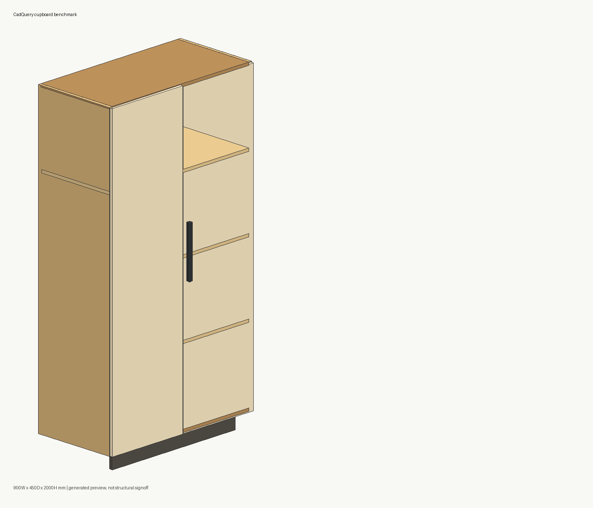
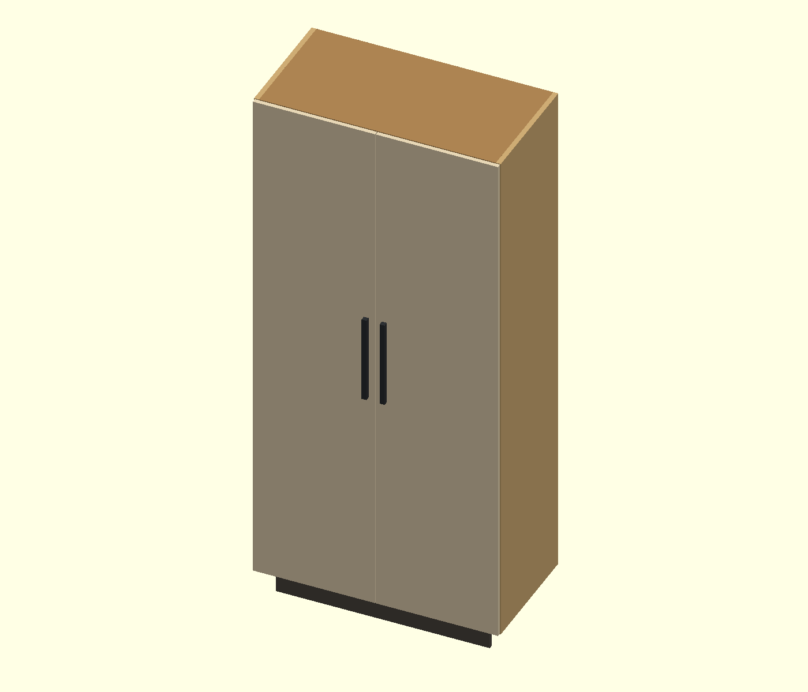
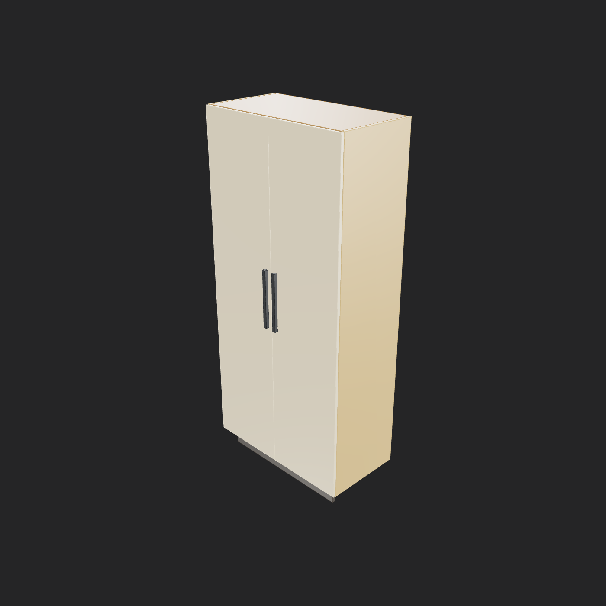

# Cupboard CAD Free-Tool Benchmark

無料でローカル実行できる CAD-as-code 系ツールを使い、同じカップボード仕様を生成して比較するためのベンチマークです。

現時点では `CadQuery`、`build123d`、`JSCAD`、`OpenSCAD`、`ForgeCAD CLI` を同じ仕様データから生成し、CAD/メッシュ出力、寸法検証、スクリーンショット、レポートをまとめます。

## 確認した前提

- このケースの作業ディレクトリは `cases\cupboard` です。
- ルートの `pyproject.toml` で Python 依存を管理し、Node 依存はこのケース内の `package.json` で管理します。
- Windows + PowerShell 前提で動かします。
- Python は AGENTS 指示どおり `uv` で扱います。Python 制約は `>=3.11,<3.12` です。
- Node 依存は `@jscad/cli`、`@jscad/modeling`、`forgecad` を `npm install` で入れます。
- 有料 API キー必須の AI CAD サービスは、今回のローカル無料ベンチから外しています。
- OpenSCAD は公式 zip をケース内の `tools\OpenSCAD-2021.01-x86-64\openscad-2021.01\openscad.exe` にポータブル配置します。別の OpenSCAD を使う場合は `OPENSCAD_BIN` に `openscad.exe` のフルパスを入れます。
- ForgeCAD は `forgecad@0.8.2` を npm dev dependency として使います。無料ローカル実行では STL/3MF/PNG は生成できましたが、STEP は Pro ライセンス要求で未生成です。
- ForgeCAD の PNG 生成は Chrome または Edge を使います。`scripts\generate_forgecad.py` が標準インストール先を探して `--chrome-path` を渡します。

## まずこれ

初回セットアップからレポート作成まで一気に動かす場合:

```powershell
cd <repo-root>
uv sync --python 3.11
cd cases\cupboard
npm install
powershell -ExecutionPolicy Bypass -File scripts\install_openscad.ps1
uv run scripts/run_all.py
```

生成結果を見る場所:

- ベンチ結果: [reports/benchmark_report.md](reports/benchmark_report.md)
- 採点 CSV: [reports/measurements.csv](reports/measurements.csv)
- スクリーンショット: [reports/screenshots/](reports/screenshots/)
- 比較動画のソース: [videos/cupboard-cad-comparison/](videos/cupboard-cad-comparison/)
- 各ツールのCAD出力: `outputs\` に再生成されます（公開リポジトリでは追跡しません）

セットアップ、個別コマンド、トラブルシュートの詳細手順は [docs/SETUP_AND_USAGE.md](docs/SETUP_AND_USAGE.md) にまとめています。

## 次回以降の最短ルート

依存関係と OpenSCAD がすでに入っている場合は、これだけで再生成できます。

```powershell
cd <repo-root>\cases\cupboard
uv run scripts/run_all.py
```

正常に終わると、`reports\benchmark_report.md` と `reports\screenshots\*.png` が更新されます。

公開リポジトリでは、再生成できるCAD出力、レンダー済みMP4、QAフレーム、内部解析ログは追跡対象から外しています。公開用に残しているのは、ソース、実行手順、軽量な比較レポート、スクリーンショット、動画を再レンダーするためのHyperFramesソースと素材です。

## 固定仕様

- 本体外形（扉/取手の前方突出を除く）: 幅 900mm × 奥行 450mm × 高さ 2000mm
- 全体 bbox（扉/取手の前方突出込み）: 幅 900mm × 奥行 484mm × 高さ 2000mm
- 蹴込み: 100mm
- 本体高さ: 1900mm
- 板厚: 側板/天板/底板/棚板 18mm、背板 6mm、扉 16mm
- 構成: 側板2、天板1、底板1、背板1、可動棚3、両開き扉2、取手2、蹴込み1

共通仕様は `cupboard_benchmark\spec.py` にあります。寸法や部品を変える場合は、まずここを見ます。

## 実行しているツール

| 方法 | 主な入力 | 主な出力 | 現状 |
|---|---|---|---|
| CadQuery | Python | STEP / STL / OBJ / PNG | STEP まで生成でき、再編集性が高い |
| build123d | Python | STEP / STL / OBJ / PNG | CadQuery と同じく OpenCascade/OCP 系で安定 |
| JSCAD | JavaScript | STL / OBJ / PNG | 軽量だが、この構成では STEP なし |
| OpenSCAD | `.scad` | SCAD / STL / OBJ / PNG | ポータブル OpenSCAD CLI で実行。STEP は未生成 |
| ForgeCAD CLI | JavaScript | STL / 3MF / OBJ / PNG | 無料ローカルでは STEP が Pro ライセンス要求。watertight は NG |

## 個別実行

一括実行の中身を個別に追いたい場合:

```powershell
uv run scripts/generate_cadquery.py
uv run scripts/generate_build123d.py
uv run scripts/generate_openscad.py
uv run scripts/generate_jscad_source.py
npm run generate:jscad
uv run scripts/finalize_jscad.py
uv run scripts/generate_forgecad_source.py
uv run scripts/generate_forgecad.py
uv run scripts/collect_screenshots.py
uv run scripts/collect_npm_audit.py
uv run scripts/score_outputs.py
uv run scripts/verify_step_imports.py
uv run scripts/verify_openscad_step_probe.py
uv run scripts/verify_text_encoding.py
uv run scripts/verify_report_images.py
uv run scripts/verify_markdown_links.py
```

## スクリーンショット

レポート用画像は `reports\screenshots\` に集約されます。








## 比較動画

HyperFrames 版の比較動画ソースは [videos/cupboard-cad-comparison/](videos/cupboard-cad-comparison/) にあります。現在の構成は日本語版で、ページ遷移をゆっくり見られるよう 82秒 / 30fps にしています。

動画用の3方向ビューとフッターアイコンを更新する場合:

```powershell
uv run scripts/generate_hyperframes_assets.py
```

3方向ビューは各ツールの固有レンダではなく、共通仕様 `cupboard_benchmark\spec.py` から描いた shared-spec orthographic guide です。各ツール固有の見た目は `reports\screenshots\` のスクリーンショットを使います。

動画を検証・レンダーする場合:

```powershell
cd videos\cupboard-cad-comparison
npx hyperframes lint
npx hyperframes validate
npx hyperframes inspect --samples 12
npx hyperframes render --output renders\cupboard-cad-comparison.mp4 --quality standard --fps 30
```

レンダー済みMP4と `qa_frames\` は再生成できるため、公開リポジトリでは追跡しません。

## レポートの読み方

- `score`: 100点満点の簡易スコアです。ソース生成、出力形式、寸法、体積、watertight、再現性を見ます。
- `bbox`: 全体 bbox が期待値から ±1mm 以内かを見ます。
- `volume`: 部品の期待体積との差が 2% 以内かを見ます。
- `watertight`: STL/OBJ が閉じたメッシュとして読めるかを見ます。
- `STEP`: 家具 CAD として再編集しやすい形式を出せるかの重要項目です。
- `PNG`: レポートに載せる画像が生成できたかを見ます。

## 既知の制約

- これは CAD 生成・可視化・出力形式のベンチマークです。家具としての強度、転倒、耐荷重、金物選定、壁固定、安全規格、製造適格性のサインオフではありません。
- ForgeCAD の STEP export は、この無料ローカル実行では Pro ライセンス要求で未生成です。詳細ログは再生成後の `outputs\forgecad\forgecad_step_probe.txt` に残します。
- OpenSCAD 2021.01 のこの実行手順では STEP は未生成です。確認結果は [reports/openscad_step_probe.csv](reports/openscad_step_probe.csv) に残します。
- npm 依存には `npm audit` で moderate が残る場合があります。現在の要約は [reports/npm_audit_summary.csv](reports/npm_audit_summary.csv) に出します。
- `PowerShell` の表示エンコーディングによって日本語が文字化けして見える場合があります。ファイル自体の検証は `uv run scripts/verify_text_encoding.py` で行い、`.venv` / `node_modules` / `tools` を除くワークスペース内 Markdown / HTML を対象にします。
- Markdown の相対リンク確認は `uv run scripts/verify_markdown_links.py` で行います。対象は `.venv` / `node_modules` / `tools` を除くワークスペース内 Markdown で、結果は再生成後の `reports\markdown_link_check.csv` に残します。

## リポジトリ案内

- [cupboard_benchmark/spec.py](cupboard_benchmark/spec.py): 共通カップボード仕様
- [cupboard_benchmark/exports.py](cupboard_benchmark/exports.py): OBJ/STL/PNG 出力補助
- [scripts/run_all.py](scripts/run_all.py): 一括ベンチ実行
- [scripts/install_openscad.ps1](scripts/install_openscad.ps1): OpenSCAD ポータブル導入
- [scripts/score_outputs.py](scripts/score_outputs.py): 採点と Markdown レポート生成
- [scripts/generate_hyperframes_assets.py](scripts/generate_hyperframes_assets.py): 比較動画用3方向ビューと素材生成
- [scripts/verify_markdown_links.py](scripts/verify_markdown_links.py): Markdown 内リンク検証
- [reports/tool_landscape.md](reports/tool_landscape.md): 候補ツールの棚卸し
- [docs/SETUP_AND_USAGE.md](docs/SETUP_AND_USAGE.md): 次回作業用の詳細手順
