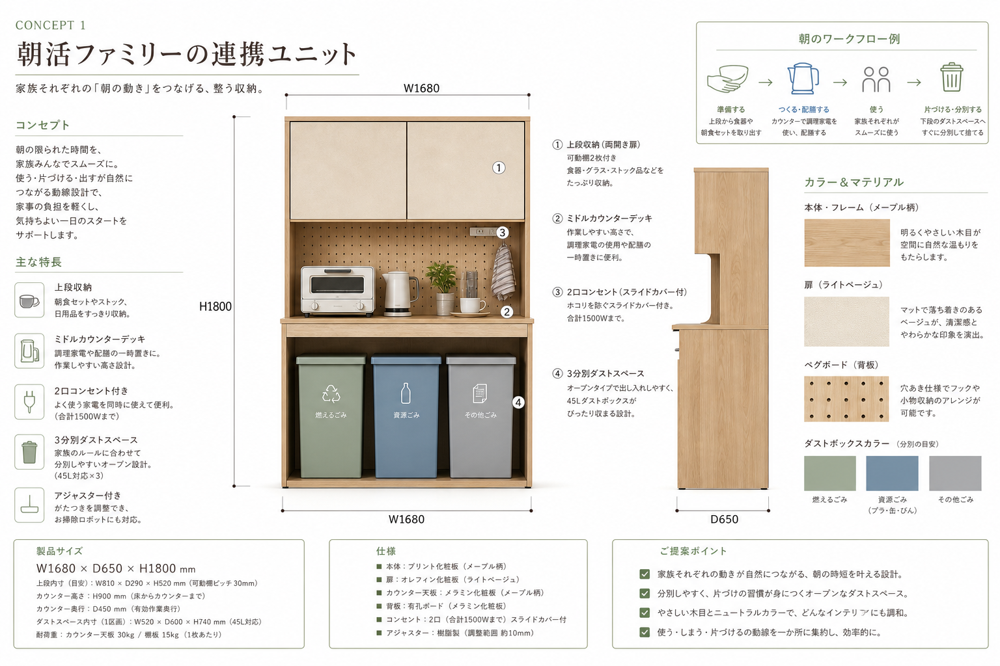
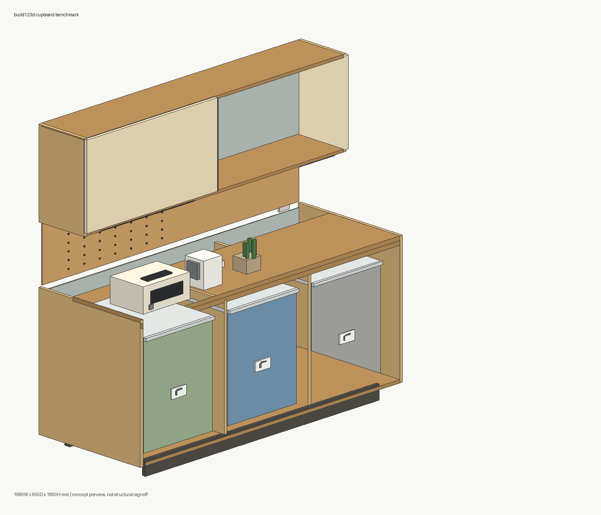
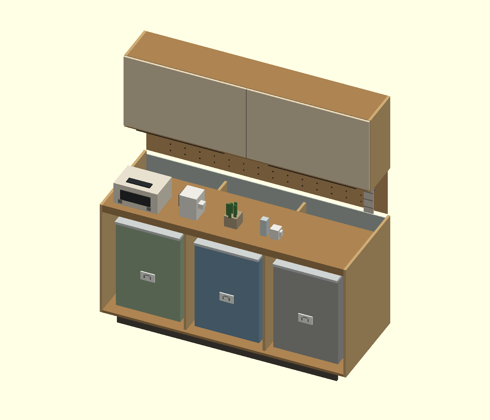

# Kitchen Trash Cupboard Concept 1 CAD Benchmark

This case generates the attached "morning workflow family unit" kitchen cupboard as a separate working copy.

- Working case: `cases\kitchen-trash-cupboard-concept1`
- Reference-only case: `cases\kitchen-trash-cupboard`
- Units: millimeters
- Target envelope: `W1680 x D650 x H1800`
- Toolchains: CadQuery, build123d, JSCAD, OpenSCAD, ForgeCAD

## Attached Concept Image



## Modeled Details

The shared specification in [cupboard_benchmark/spec.py](cupboard_benchmark/spec.py) defines 150 box-based parts:

- shallow upper double-door storage
- open middle counter deck
- pegboard with hole pattern
- two-socket outlet plate and slide cover
- toaster, kettle, mug, glass, plant, and hanging towel placeholders
- three open trash-bin bays with green, blue, and gray bins
- recessed toe kick and adjustable-foot hints

The model is a visual/CAD generation benchmark, not a structural manufacturing sign-off.

The concept1 deliverables were adjusted through an explicit feedback loop against the attached concept sheet: compare generated outputs to the sheet, identify mismatches in layout/detail/scoring, update the model/report/video, and re-verify with screenshots, concept-vs comparison images, and QA frames.

## Run

```powershell
cd <repo-root>
uv sync --python 3.11
cd cases\kitchen-trash-cupboard-concept1
npm install
uv run scripts\run_all.py
```

OpenSCAD is already copied under `tools\OpenSCAD-2021.01-x86-64` in this case. To reinstall it:

```powershell
powershell -ExecutionPolicy Bypass -File scripts\install_openscad.ps1
```

## Outputs

- Benchmark report: [reports/benchmark_report.md](reports/benchmark_report.md)
- Measurements: [reports/measurements.csv](reports/measurements.csv)
- Score breakdown: [reports/score_breakdown.csv](reports/score_breakdown.csv)
- Score item evidence: [reports/score_items.csv](reports/score_items.csv)
- Output file fingerprints: [reports/output_file_fingerprints.csv](reports/output_file_fingerprints.csv)
- Image metrics: [reports/image_metrics.csv](reports/image_metrics.csv)
- Non-scored limits: [reports/non_scored_limits.csv](reports/non_scored_limits.csv)
- Run status: [reports/run_all_last_result.csv](reports/run_all_last_result.csv)
- Screenshots: [reports/screenshots/](reports/screenshots/)
- Video source: [videos/kitchen-trash-cupboard-concept1-comparison/](videos/kitchen-trash-cupboard-concept1-comparison/)
- Local rendered MP4: `videos\kitchen-trash-cupboard-concept1-comparison\renders\kitchen-trash-cupboard-concept1-comparison.mp4`
- CAD outputs: `outputs\cadquery`, `outputs\build123d`, `outputs\jscad`, `outputs\openscad`, `outputs\forgecad`

## Current Verification

Latest `uv run scripts\run_all.py` completed with `status=ok`, `returncode=0`, `completed_steps=16`, `total_steps=16`.

All five toolchains generated source, STL, OBJ, and PNG preview/report images. CadQuery and build123d also generated STEP files. JSCAD, OpenSCAD 2021.01, and the local free ForgeCAD path do not generate STEP in this setup.

`reports/measurements.csv` shows the generated bbox is within tolerance:

- CadQuery: `1680 x 650 x 1800`
- build123d: `1680 x 650 x 1800`
- JSCAD: `1680.001 x 649.993 x 1800.005`
- OpenSCAD: `1680 x 650 x 1800`
- ForgeCAD: `1680 x 650 x 1800`

The current score rubric is itemized rather than capped after the fact. It uses four categories: layout/dimensions (25), visual/detail fidelity (35), CAD output quality (25), and evidence/verification (15). Screenshot image metrics are used as supporting evidence for visual/detail scores. Current totals are:

- CadQuery: `84.0` / B
- build123d: `84.0` / B
- JSCAD: `76.0` / C
- OpenSCAD: `76.0` / C
- ForgeCAD: `76.0` / C

## Screenshots








## Known Limits

- ForgeCAD `render 3d` timed out in this environment, so reports use the shared preview PNG. The timeout is logged in `outputs\forgecad\forgecad_render.txt`.
- ForgeCAD STEP export was attempted, but the local CLI reported a Pro license requirement. See `outputs\forgecad\forgecad_step_probe.txt`.
- OpenSCAD 2021.01 did not generate STEP for this source. See [reports/openscad_step_probe.csv](reports/openscad_step_probe.csv).
- `npm audit` reports four moderate issues inherited from the existing dependency set. The count is recorded in [reports/npm_audit_summary.csv](reports/npm_audit_summary.csv).
