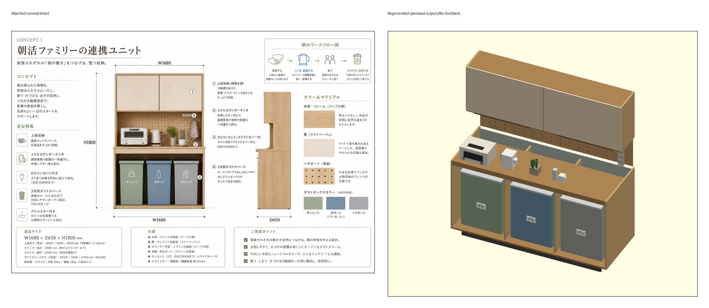
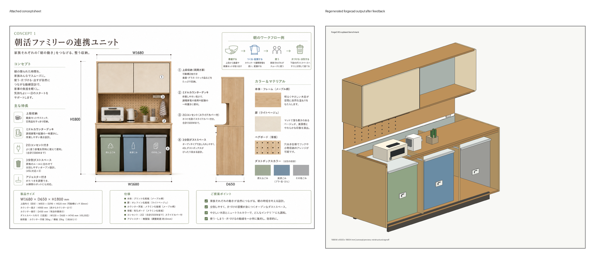

# ゴミ箱3台対応キッチンカップボードCAD 無料ツールチェーン ベンチマーク

## 前提

これは家具の見た目・CADデータ生成品質の比較です。耐荷重、転倒防止、ゴミ箱の実製品適合、金物、施工、安全規格の製造サインオフではありません。

## 固定仕様

- 本体外形（扉/取手の前方突出を除く）: 幅 1680.0mm × 奥行 650.0mm × 総高 1800.0mm
- 全体bbox（扉/取手の前方突出込み）: [1680.0, 650.0, 1800.0]mm
- 内寸目安: 幅 1644.0mm × 奥行 644.0mm × 高さ 1692.0mm
- 下部ゴミ箱ベイ: 3列、1列あたり有効幅 約 520.0mm × 有効奥行 600.0mm × 有効高さ 740.0mm
- ゴミ箱プレースホルダー: [440.0, 500.0, 620.0]mm × 3台
- 板厚: 側板/天板/底板/棚板 18.0mm、背板 6.0mm、扉 16.0mm
- 部品数: 150 ({'carcass': 11, 'counter': 1, 'divider': 3, 'toe_kick': 3, 'trash_bin': 3, 'trash_lid': 6, 'bin_label': 12, 'pegboard': 1, 'peg_hole': 75, 'counter_appliance': 8, 'counter_decor': 9, 'outlet': 4, 'towel': 5, 'shelf': 4, 'door': 2, 'door_detail': 3})

## 実行環境

- OS: Windows-10-10.0.26200-SP0
- Python/uv: uv 0.10.8 (c021be36a 2026-03-03)
- Node: v24.12.0
- npm: npm found
- OpenSCAD CLI: OpenSCAD version 2021.01
- ForgeCAD CLI: npx found + local forgecad package

## 採点方式

総合点は単一の上限キャップではなく、下の4カテゴリの項目別加点で算出します。各項目の点数、満点、判定、根拠は [score_items.csv](score_items.csv) に、候補別の内訳は [score_breakdown.csv](score_breakdown.csv) に保存しています。出力ファイルのサイズ、mtime、sha256短縮値、鮮度フラグは [output_file_fingerprints.csv](output_file_fingerprints.csv) に保存しています。画像の非空率、エッジ密度、色数サンプルは [image_metrics.csv](image_metrics.csv)、採点外の重要限界は [non_scored_limits.csv](non_scored_limits.csv) に分離しています。

| カテゴリ | 配点 | 評価内容 |
|---|---:|---|
| レイアウト/寸法 | 25 | `W1680 x D650 x H1800`、上段 `D290` 奥寄せ、カウンター `H900/D450`、3分別ダスト空間、背面ペグボード位置、部品干渉 |
| 視覚/詳細 | 35 | 上段扉、棚、ペグ穴、コンセント、家電/小物、3色ゴミ箱、素材色、ラベル、曲面/布/木目の再現度。スクリーンショットの画像メトリクスも補助根拠にする |
| CAD出力 | 25 | source/manifest、STL/OBJ、STEP、bbox/volume、watertight、測定エラーの有無 |
| 証拠/検証 | 15 | 添付コンセプト画像、手法別比較画像、候補スクリーンショット、採点CSV、限界の明示 |

等級の目安: `A >= 90`, `B >= 80`, `C >= 70`, `D >= 60`, `F < 60`。今回の共有モデルはボックス部品ベースなので、木目、丸い家電、布のしわ、正確な印字ラベル、細かい金物は視覚/詳細カテゴリで明示的に減点します。画像メトリクスは「存在確認だけ」ではなく、レンダーの密度や色分離を補助的に見るためのもので、写真意味理解の自動一致判定ではありません。

`output_file_fingerprints.csv` の `newer_than_last_full_run` は、CAD本体ではなく採点後に作る比較画像などが直近の `run_all` marker より新しい場合に出ます。これは時刻関係をそのまま記録するフラグで、CAD出力の成功判定とは分けています。

## 結果

### フル出力候補

| 方法 | 総合 | 等級 | レイアウト | 視覚/詳細 | CAD出力 | 証拠 | Source | STEP | STL | OBJ | PNG | 実測bboxサイズ(mm) | bbox | volume | watertight | 主な減点 |
|---|---:|---|---:|---:|---:|---:|---|---|---|---|---|---|---|---|---|---|
| CadQuery | 84.0 | B | 25.0/25 | 19.0/35 | 25.0/25 | 15.0/15 | OK | OK | OK | OK | OK | [1680.0, 650.0, 1800.0] | OK | OK | OK | visual_detail:fine hardware, labels, curves, and fabric realism -5 visual_detail:counter appliances and small morning objects -4 visual_detail:three colored bins, lids, and front labels -2 visual_detail:pegboard, outlet, slide cover, and towel zone -2 |
| build123d | 84.0 | B | 25.0/25 | 19.0/35 | 25.0/25 | 15.0/15 | OK | OK | OK | OK | OK | [1680.0, 650.0, 1800.0] | OK | OK | OK | visual_detail:fine hardware, labels, curves, and fabric realism -5 visual_detail:counter appliances and small morning objects -4 visual_detail:three colored bins, lids, and front labels -2 visual_detail:pegboard, outlet, slide cover, and towel zone -2 |
| JSCAD | 76.0 | C | 25.0/25 | 19.0/35 | 17.0/25 | 15.0/15 | OK | NG | OK | OK | OK | [1680.001, 649.993, 1800.005] | OK | OK | NG | visual_detail:fine hardware, labels, curves, and fabric realism -5 cad_output:STEP/native exchange output -5 visual_detail:counter appliances and small morning objects -4 cad_output:watertight mesh -3 |
| OpenSCAD | 76.0 | C | 25.0/25 | 19.0/35 | 17.0/25 | 15.0/15 | OK | NG | OK | OK | OK | [1680.0, 650.0, 1800.0] | OK | OK | NG | visual_detail:fine hardware, labels, curves, and fabric realism -5 cad_output:STEP/native exchange output -5 visual_detail:counter appliances and small morning objects -4 cad_output:watertight mesh -3 |
| ForgeCAD | 76.0 | C | 25.0/25 | 19.0/35 | 17.0/25 | 15.0/15 | OK | NG | OK | OK | OK | [1680.0, 650.0, 1800.0] | OK | OK | NG | visual_detail:fine hardware, labels, curves, and fabric realism -5 cad_output:STEP/native exchange output -5 visual_detail:counter appliances and small morning objects -4 cad_output:watertight mesh -3 |

## 添付コンセプト画像

## 手法別コンセプト比較画像

### cadquery

### build123d

### jscad

### openscad

### forgecad

## コンセプト照合

- 点数はCAD生成成功だけではなく、添付コンセプトへの近さを `レイアウト/寸法` と `視覚/詳細` に分けて採点しています。共有ボックス部品モデルでは、木目テクスチャ、丸みのある家電、布のしわ、印字ラベル、金物詳細を表現しきれないため、視覚/詳細カテゴリで減点します。
- 上段収納はコンセプト側面図の `D290` に合わせ、奥側へ浅く配置しています。現行仕様では上段前面Y=360.0mm、上段扉Y=344.0mm、背板Y=644.0mmです。
- ペグボードはカウンター上から上段収納下までの背面に配置し、穴列、2口コンセント、朝家電、小物、タオル、3色ゴミ箱を再現対象にしています。
- それでも現行成果物は「5ツールで同じ構成を生成するためのCAD近似」であり、添付画像のカタログ品質そのものではありません。

## PDCA再照合

| 観点 | コンセプト画像の要件 | 修正後CADの証拠 | 判定 |
|---|---|---|---|
| 上段収納の奥行 | 側面図は上段収納を `D290` の浅い奥側収納として示している | `upper_front_y=360.0mm`, `upper_door_y=344.0mm`, `upper_back_y=644.0mm` | OK |
| 背面/ペグボード | カウンター上の背面に穴あきボード、2口コンセント、フック類がある | `pegboard_y=644.0mm`, ペグ穴75個相当、コンセント部品あり | OK |
| 下部ダストスペース | 3分別のオープンなダストボックス空間 | 3列、緑/青/灰のゴミ箱、前面ラベル、上フタ表現あり | OK |
| 外形寸法 | `W1680 x D650 x H1800` | 5出力すべてbboxが許容内、CadQuery/build123dは `1680 x 650 x 1800` | OK |
| 点数 | カタログ画像の完全再現ではない | 単一キャップを廃止し、4カテゴリ・項目別根拠で採点。詳細は `score_items.csv` | OK |
| 残る限界 | 木目、布、家電の丸み、文字ラベル、金物質感が写真調 | 共有ボックス部品CADのため未再現。点数とメモに明記 | 残リスク |

## 画像スクリーンショット

### cadquery

### build123d

### jscad

### openscad

### forgecad

## 採点メモ

- 寸法・構成は同じ仕様データから生成したため、主な差は「ネイティブCAD出力」「メッシュ出力」「パーツ名/再編集性」「CLIだけで完結するか」に出ます。
- 本体奥行は650.0mm、実測bbox奥行650.0mmは上部扉と取手の前方突出を含む値です。
- 下部は扉を付けず、3つのゴミ箱を引き出しやすいオープンベイとして扱っています。
- `bbox` は全体bbox許容±1mm、`volume` は部品重なりがない現行仕様で期待体積との差2%以内、`watertight` はSTL/OBJのどちらかで閉じたメッシュとして読めるかを示します。
- 現行仕様のボックス部品は正の体積を持つ重なりがないことを前提に、体積和を期待値にしています。重なりを持つモデルへ拡張する場合はユニオン体積基準に変える必要があります。
- `CadQuery` と `build123d` は OpenCascade/OCP 系で STEP が出せるため、家具CADとして再編集しやすいです。
- `JSCAD` は導入が軽くブラウザ/CLIに強い一方、このローカル構成ではSTEP出力なしのメッシュ中心です。
- `OpenSCAD` はCLIが見つかる場合にSTLとPNGスクリーンショットを生成します。この実行手順ではOpenSCADのSTEPファイル生成は未成功のため、STEPはNGのままです。
- `ForgeCAD` はSTL/3MF/PNGをCLIで生成できましたが、STEPはProライセンス要求で未生成です。STL/OBJはbboxとvolumeは合格、`watertight` はNGです。STEP試行ログ: `../outputs/forgecad/forgecad_step_probe.txt`

## 依存セキュリティ

- `npm audit --json`: total=4, moderate=4, high=0, critical=0
- 詳細: `npm_audit.json` / `npm_audit_summary.csv`

## 未確認・リスク

- 実物家具の強度、反り、木口処理、蝶番、ダボ、壁固定、施工クリアランスは未評価です。
- CADAM、OpenSCAD Studio のAI機能、Fusion/Onshape MCP は APIキーや外部アプリ/アカウント前提になりやすいため、今回の無料ローカル実行ベンチからは外しています。
- PNGはベンチ用の簡易アイソメ図またはCLIレンダー画像で、実物色・仕上げの決定図ではありません。
