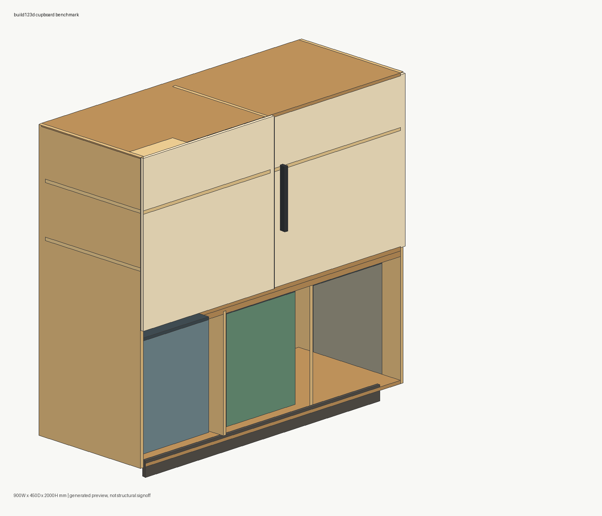
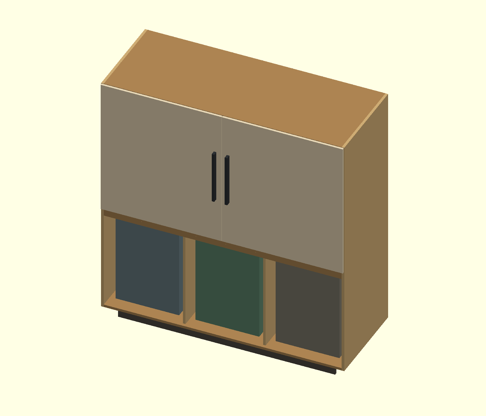
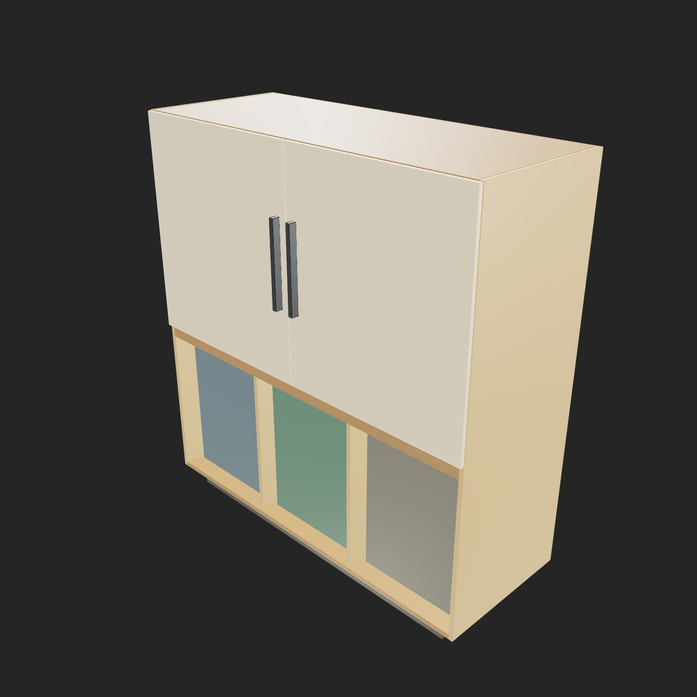

# ゴミ箱3台対応キッチンカップボードCAD 無料ツールチェーン ベンチマーク

## 前提

これは家具の見た目・CADデータ生成品質の比較です。耐荷重、転倒防止、ゴミ箱の実製品適合、金物、施工、安全規格の製造サインオフではありません。

## 固定仕様

- 本体外形（扉/取手の前方突出を除く）: 幅 1680.0mm × 奥行 650.0mm × 総高 1800.0mm
- 全体bbox（扉/取手の前方突出込み）: [1680.0, 698.0, 1800.0]mm
- 内寸目安: 幅 1644.0mm × 奥行 644.0mm × 高さ 1692.0mm
- 下部ゴミ箱ベイ: 3列、1列あたり有効幅 約 536.0mm × 有効奥行 590.0mm × 有効高さ 712.0mm
- ゴミ箱プレースホルダー: [440.0, 500.0, 620.0]mm × 3台
- 板厚: 側板/天板/底板/棚板 18.0mm、背板 6.0mm、扉 16.0mm
- 部品数: 26 ({'carcass': 8, 'divider': 3, 'shelf': 4, 'trash_bin': 3, 'trash_lid': 3, 'door': 2, 'handle': 2, 'toe_kick': 1})

## 実行環境

- OS: Windows-10-10.0.26200-SP0
- Python/uv: uv 0.10.8 (c021be36a 2026-03-03)
- Node: v24.12.0
- npm: npm found
- OpenSCAD CLI: OpenSCAD version 2021.01
- ForgeCAD CLI: npx found + local forgecad package

## 結果

### フル出力候補

| 方法 | 点 | Source | STEP | STL | OBJ | PNG | 実測bboxサイズ(mm) | bbox | volume | watertight | メモ |
|---|---:|---|---|---|---|---|---|---|---|---|---|
| CadQuery | 100 | OK | OK | OK | OK | OK | [1680.0, 698.0, 1800.0] | OK | OK | OK | CadQuery exports native STEP and STL through OpenCascade/OCP. |
| build123d | 100 | OK | OK | OK | OK | OK | [1680.0, 698.0, 1800.0] | OK | OK | OK | build123d exports STEP and STL through OpenCascade/OCP. |
| JSCAD | 98 | OK | NG | OK | OK | OK | [1680.002, 698.005, 1799.994] | OK | OK | OK | JSCAD is mesh/CSG oriented here; STEP output is not part of this local CLI run. |
| OpenSCAD | 98 | OK | NG | OK | OK | OK | [1680.0, 698.0, 1800.0] | OK | OK | OK | OpenSCAD source was generated locally. OBJ was converted from the OpenSCAD STL using trimesh. OpenSCAD CLI was found; STL and PNG screenshot export completed. |
| ForgeCAD | 94 | OK | NG | OK | OK | OK | [1680.0, 698.0, 1800.0] | OK | OK | NG | ForgeCAD CLI was installed as a local npm dev dependency. STL and 3MF were exported with ForgeCAD CLI; PNG was rendered with ForgeCAD render 3d. OBJ was converted from ForgeCAD STL using trimesh. STEP export was attempted but ForgeCAD reported that export step requires a Pro license. |

### ソースのみ参考枠

| 方法 | 点 | Source | STEP | STL | OBJ | PNG | 実測bboxサイズ(mm) | bbox | volume | watertight | メモ |
|---|---:|---|---|---|---|---|---|---|---|---|---|

## 画像スクリーンショット

### cadquery

### build123d

### jscad

### openscad

### forgecad

## 採点メモ

- 寸法・構成は同じ仕様データから生成したため、主な差は「ネイティブCAD出力」「メッシュ出力」「パーツ名/再編集性」「CLIだけで完結するか」に出ます。
- 本体奥行は650.0mm、実測bbox奥行698.0mmは上部扉と取手の前方突出を含む値です。
- 下部は扉を付けず、3つのゴミ箱を引き出しやすいオープンベイとして扱っています。
- `bbox` は全体bbox許容±1mm、`volume` は部品重なりがない現行仕様で期待体積との差2%以内、`watertight` はSTL/OBJのどちらかで閉じたメッシュとして読めるかを示します。
- 現行仕様のボックス部品は正の体積を持つ重なりがないことを前提に、体積和を期待値にしています。重なりを持つモデルへ拡張する場合はユニオン体積基準に変える必要があります。
- `CadQuery` と `build123d` は OpenCascade/OCP 系で STEP が出せるため、家具CADとして再編集しやすいです。
- `JSCAD` は導入が軽くブラウザ/CLIに強い一方、このローカル構成ではSTEP出力なしのメッシュ中心です。
- `OpenSCAD` はCLIが見つかる場合にSTLとPNGスクリーンショットを生成します。この実行手順ではOpenSCADのSTEPファイル生成は未成功のため、STEPはNGのままです。
- `ForgeCAD` はSTL/3MF/PNGをCLIで生成できましたが、STEPはProライセンス要求で未生成です。STL/OBJはbboxとvolumeは合格、`watertight` はNGです。STEP試行ログ: `../outputs/forgecad/forgecad_step_probe.txt`

## 依存セキュリティ

- `npm audit --json`: total=4, moderate=4, high=0, critical=0
- 詳細: `npm_audit.json` / `npm_audit_summary.csv`

## 動画検証

- `npx hyperframes lint`: 0 errors / 1 warning (`composition_file_too_large`)
- `npx hyperframes validate`: no console errors, 507 text elements pass WCAG AA
- `npx hyperframes inspect --samples 12`: 0 layout issues

## 未確認・リスク

- 実物家具の強度、反り、木口処理、蝶番、ダボ、壁固定、施工クリアランスは未評価です。
- CADAM、OpenSCAD Studio のAI機能、Fusion/Onshape MCP は APIキーや外部アプリ/アカウント前提になりやすいため、今回の無料ローカル実行ベンチからは外しています。
- PNGはベンチ用の簡易アイソメ図またはCLIレンダー画像で、実物色・仕上げの決定図ではありません。
